<a id="top"></a>

<p align="center">
  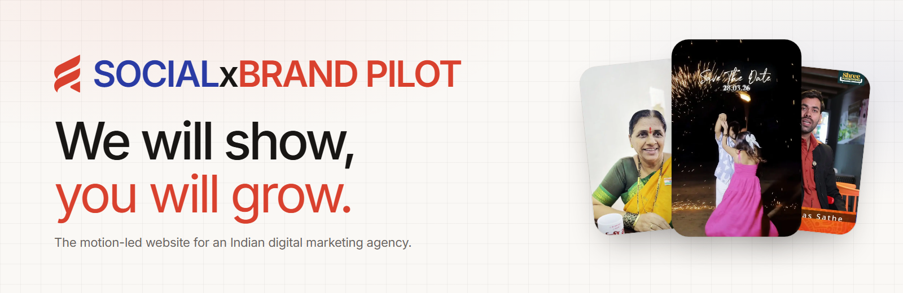
</p>

<p align="center">
  
  
  
  
  
  
  
</p>

<p align="center">
  <b>The motion-led website for SOCIALxBRAND PILOT, an Indian digital marketing agency.</b><br>
  The work is the hero: real reels play inside the headline, open out to fill the screen,<br>
  and run through every section, all from the client's own footage. No stock, no invented proof.
</p>

<p align="center">
  <a href="#quick-start"><b>Quick start</b></a> ·
  <a href="#a-tour-of-the-home-page"><b>Tour</b></a> ·
  <a href="#how-it-is-built"><b>How it is built</b></a> ·
  <a href="#check-it-yourself"><b>Check it yourself</b></a> ·
  <a href="HANDOVER.md"><b>Handover</b></a>
</p>

<br>

<p align="center">
  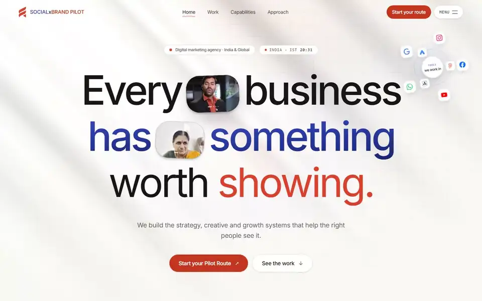
</p>
<p align="center">
  <sub>The hero. Capsules in the headline play the client's reels and roll to the next clip; on scroll, the top capsule morphs into the full-screen reel behind the manifesto.</sub>
</p>

<details>
<summary><b>Table of contents</b></summary>

- [Why it is built this way](#why-it-is-built-this-way)
- [House rules](#house-rules)
- [A tour of the home page](#a-tour-of-the-home-page)
- [Every page](#every-page)
- [On a phone](#on-a-phone)
- [How it is built](#how-it-is-built)
- [Quick start](#quick-start)
- [Check it yourself](#check-it-yourself)
- [FAQ](#faq)
- [Documentation](#documentation)
- [Built with](#built-with)
- [Credits](#credits)

</details>

## Why it is built this way

An agency that promises *"We will show, you will grow"* has to show first. Most agency sites tell:
logos, numbers, testimonials. This one shows the work itself, moving, from the first frame, and
explains the 18 divisions and the method around it. Motion carries the story: the site reads like
a short film you scroll through, and it still works completely for anyone who switches motion off.

## House rules

These are enforced in review and, where possible, by tests.

| Rule | How it holds |
|---|---|
| No invented content | No clients, metrics, ROI, testimonials, awards, team, prices or city. Every claim traces to `src/content/*`, transcribed from the client's PDFs. A content audit test fails on proof-shaped text. |
| Real work only | All 95 media assets (43 reels) come from the client's Drive through `scripts/media/*`, credited *Production partner: Vishay Creations*. |
| Vertical stays vertical | 9:16 reels are never letterboxed. In landscape layouts they stand upright over their own blurred light. |
| Reduced motion and no-JS are complete | Every animated reveal has a static fallback and a CSS failsafe, so nothing stays hidden. |
| One motion grammar | Shared ease and duration tokens in `src/lib/motion/tokens.ts`, mirrored in CSS. |

<p align="right"><a href="#top">Back to top ↑</a></p>

## A tour of the home page

<table>
  <tr>
    <td width="50%">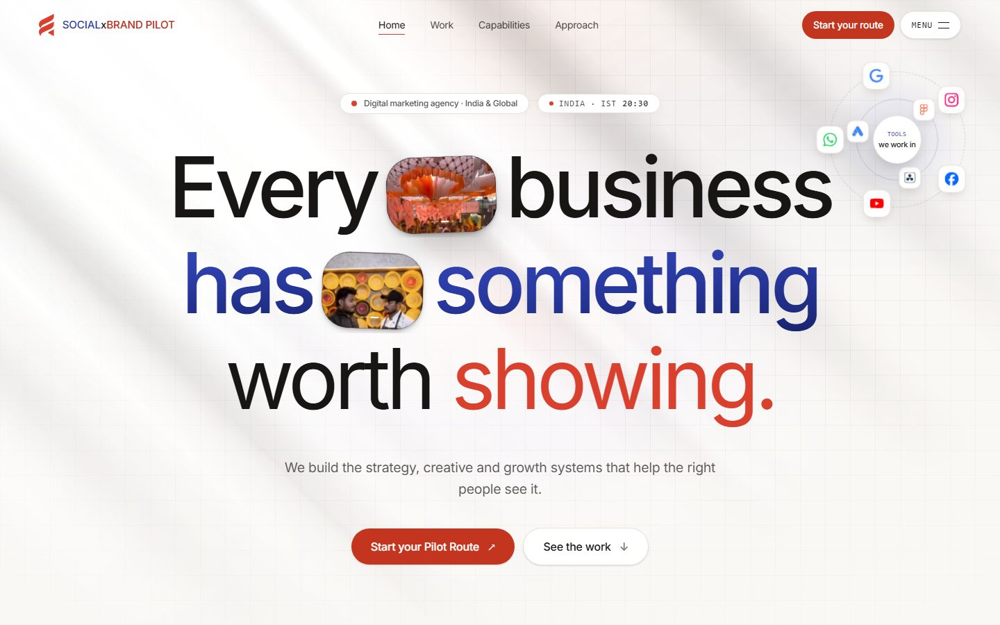</td>
    <td width="50%">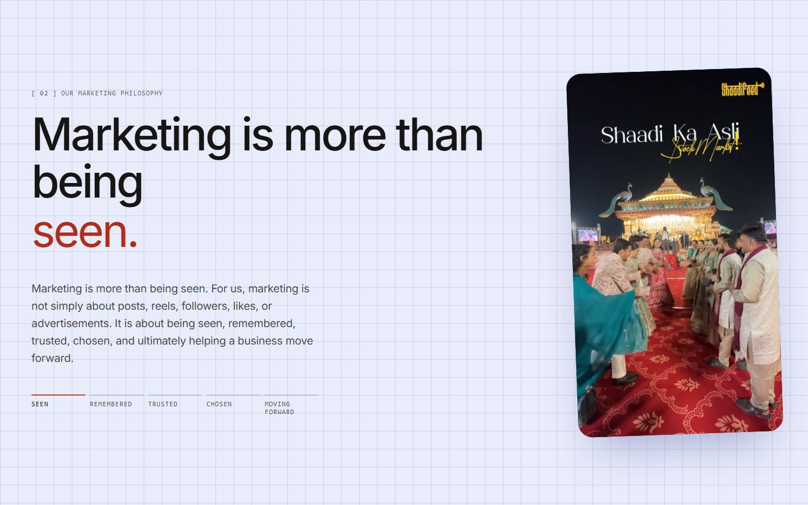</td>
  </tr>
  <tr>
    <td><sub><b>1 · Hero.</b> Media capsules inside the words, diagonal window light that drifts slowly, and an orbit of the platforms and tools the agency works in.</sub></td>
    <td><sub><b>2 · Philosophy.</b> <i>Seen → remembered → trusted → chosen → moving forward.</i> The word changes in place and the reel swipes to the next clip like a feed.</sub></td>
  </tr>
  <tr>
    <td>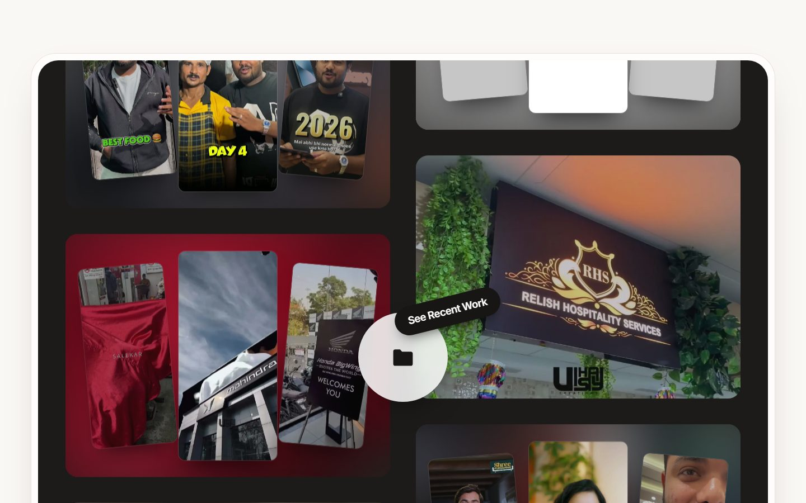</td>
    <td>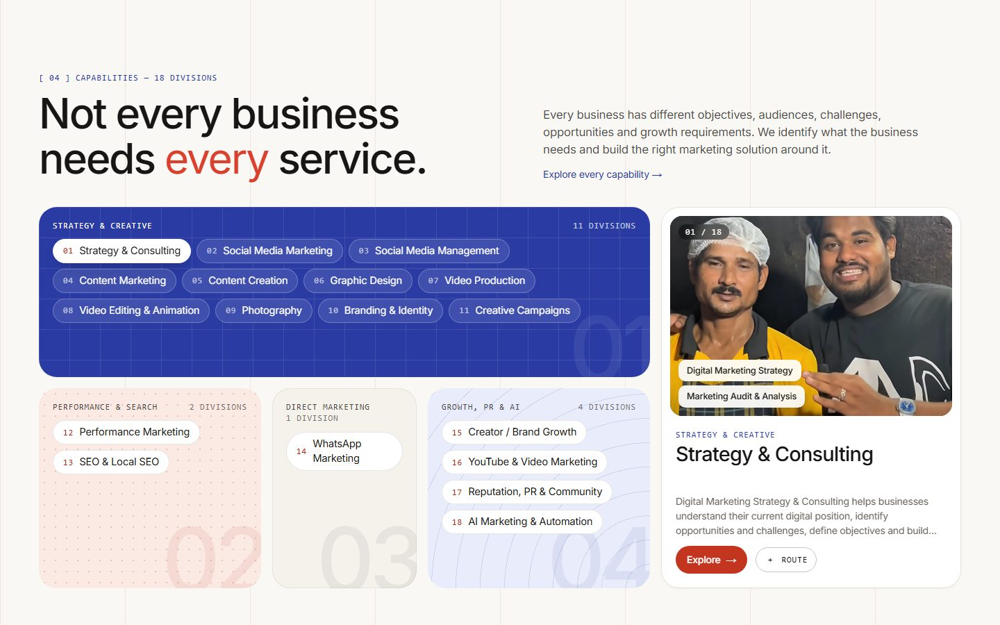</td>
  </tr>
  <tr>
    <td><sub><b>3 · Recent work.</b> A dark screen set into the page. Two columns loop forever in opposite directions; the disc opens the full archive.</sub></td>
    <td><sub><b>4 · Capabilities.</b> All 18 divisions on one screen, as four cluster tiles beside a stage that plays the selected division's work.</sub></td>
  </tr>
  <tr>
    <td colspan="2">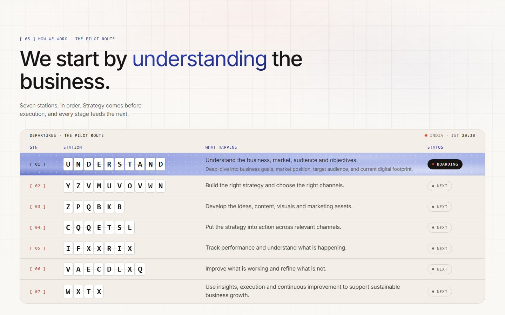</td>
  </tr>
  <tr>
    <td colspan="2"><sub><b>5 · The Pilot Route.</b> The seven-station method as a split-flap departures board. Station names start scrambled and flap into place as you reach them, while the status runs <i>Next → Boarding → Cleared</i>.</sub></td>
  </tr>
</table>

<p align="center">
  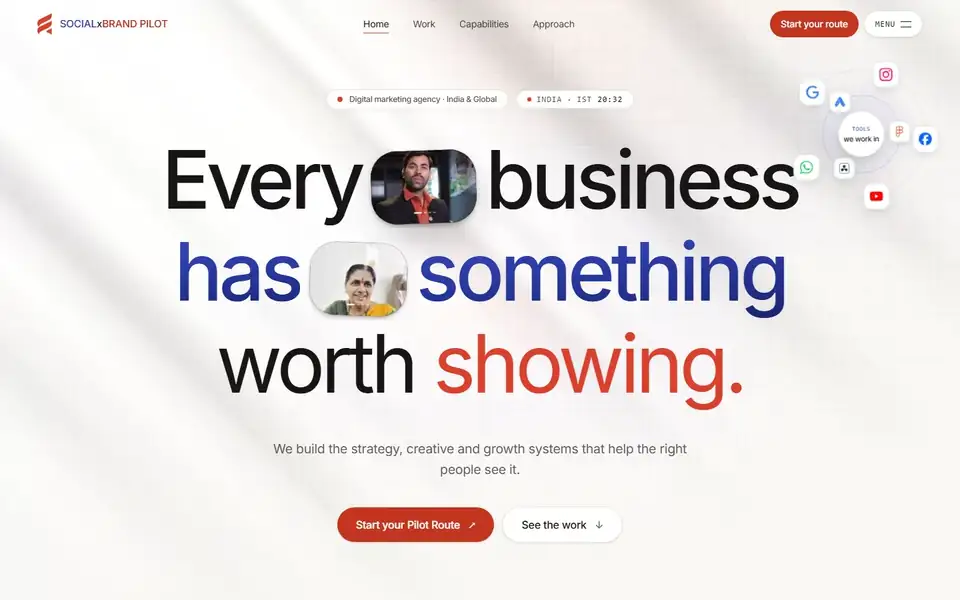
</p>
<p align="center">
  <sub>The recent work panel keeps moving when you stop scrolling. Scrolling flicks it faster, then it eases back.</sub>
</p>

<p align="right"><a href="#top">Back to top ↑</a></p>

## Every page

<table>
  <tr>
    <td width="33%">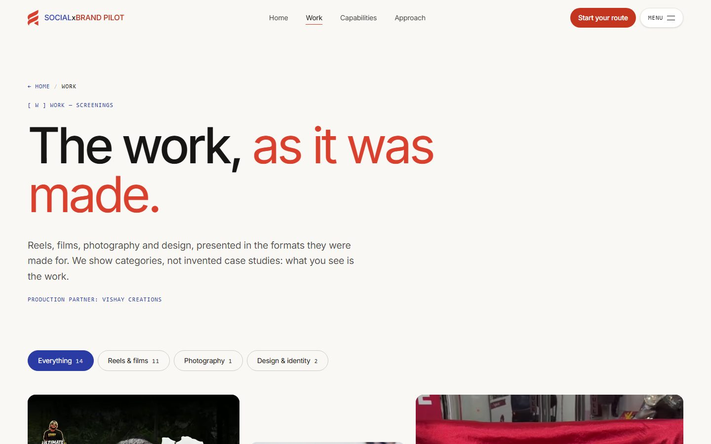</td>
    <td width="33%">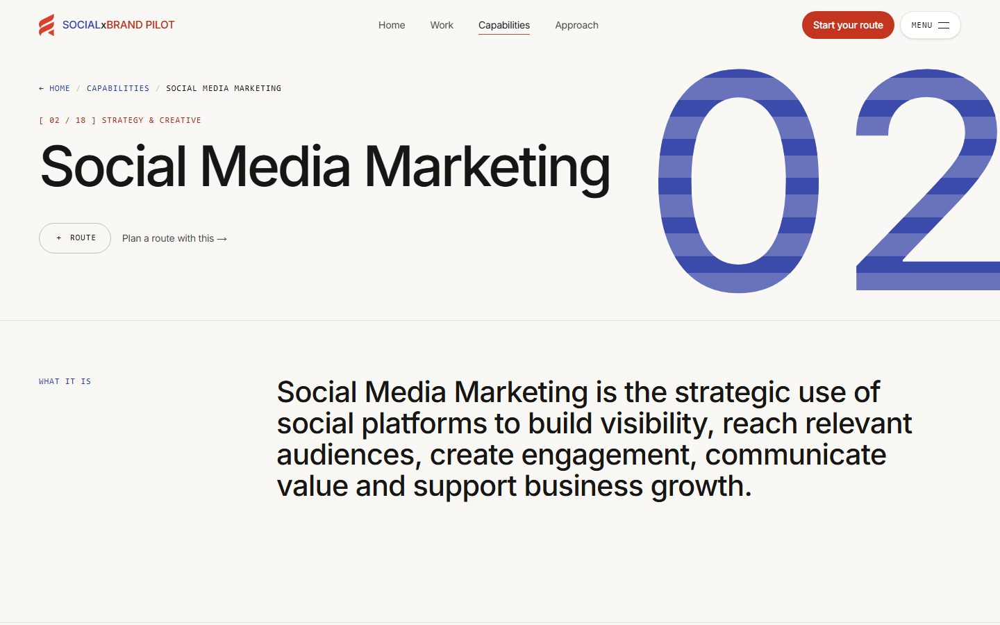</td>
    <td width="33%">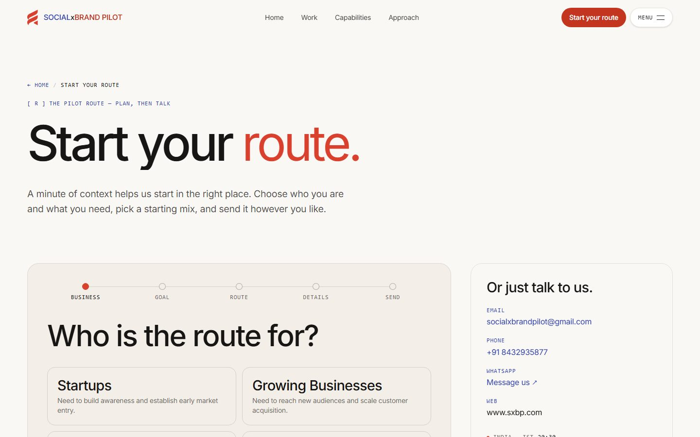</td>
  </tr>
  <tr>
    <td><sub><b>/work.</b> 14 screenings, filterable by format, each with its own page.</sub></td>
    <td><sub><b>/capabilities/…</b> One page per division: what it is, deliverables, approach and related work.</sub></td>
    <td><sub><b>/route.</b> Plan a starting mix of divisions, then send it by WhatsApp or email.</sub></td>
  </tr>
</table>

Every inner page opens with a breadcrumb trail and ends with a *Where to next?* band. The nav comes
back for the last stretch of every page, so a visitor never has to scroll back to find the way on.

## On a phone

<table>
  <tr>
    <td width="33%">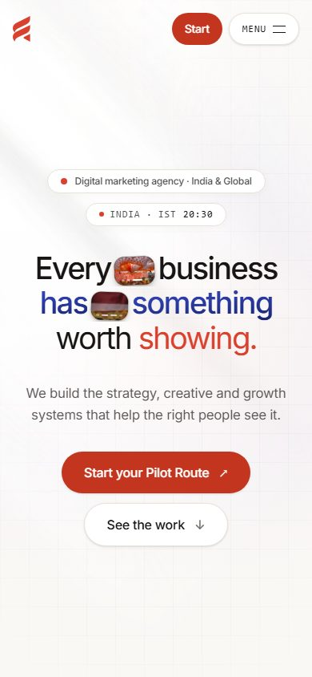</td>
    <td width="33%">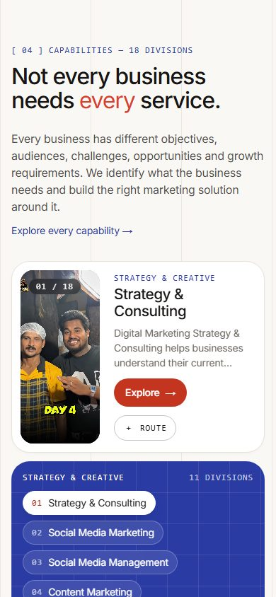</td>
    <td width="33%">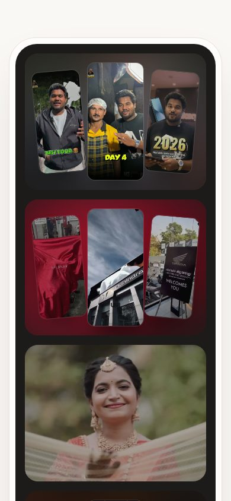</td>
  </tr>
</table>

Small screens get their own choreography, not a shrunk desktop: nothing pins, scenes play once as
they enter, and swipe rails replace scroll-driven tracks.

<p align="right"><a href="#top">Back to top ↑</a></p>

## How it is built

- **Next.js 16 App Router** with React 19 `<ViewTransition>` page transitions. Every route is
  statically generated.
- **GSAP 3.15** (ScrollTrigger, Flip, DrawSVG, CustomEase) driven through `gsap.matchMedia`, so desktop,
  phone and reduced motion each get their own timeline. Long scenes hold with CSS `sticky`, not
  GSAP pins, so landing mid-page never jumps.
- **Lenis** smooth scrolling on the GSAP ticker.
- **Tailwind CSS 4** with design tokens in `@theme`, plus custom variants: `cinema:` for desktop with
  motion, and `short:` for short laptop screens.
- **A video budget.** A shared cap on concurrent playback, and posters until a reel is on screen.
  The hero plays at most two clips per capsule during a handover.
- **Content as data.** The 18 divisions, the method, the audiences and the work all live in
  `src/content/*`. The pages render from it.

```
src/
├─ app/          routes: home, work, capabilities, approach, route
├─ components/   home acts, capabilities, work, route builder, layout, media, fx, motion
├─ content/      divisions, site profile, work screenings, generated media index
└─ lib/          gsap registration, motion tokens, route store and adapters, SEO
```

## Quick start

On Windows, double-click `startup.bat`. It installs dependencies when needed, starts the site on
http://localhost:3100 and opens your browser. Run `startup.bat help` for options.

Anywhere else:

```bash
npm install
npm run dev -- --port 3100
```

```bash
npm run build
npm start
```

<p align="right"><a href="#top">Back to top ↑</a></p>

## Check it yourself

The test suite covers content integrity, accessibility (axe), reduced motion and the route
planner end to end:

```bash
npx playwright test
```

```text
  33 passed · 6 skipped (viewport-specific)
```

QA scripts in `scripts/qa/` drive a real browser against the dev server on port 3100:

| Script | What it proves |
|---|---|
| `sweep.mjs` | Every route at six viewports, no horizontal overflow, no page errors (add `--reduce` for reduced motion) |
| `record.mjs` | Records a scroll-through video of each route and logs every console error, failed request and 4xx |
| `check-shift.mjs` | Layout stability: layout shift (CLS) and page height, idle and while scrolling |
| `check-flow.mjs` | No dead ends: the nav, a Home link and onward links are on screen at the end of every page |
| `check-motion.mjs` | The work loops keep running idle, the disc sits centred, the method board unscrambles |

The images in this README are produced the same way: `node scripts/readme/capture.mjs`.

## FAQ

<details>
<summary><b>Where do the videos and photos come from?</b></summary>
<br>
The client's Google Drive. <code>scripts/media/</code> inventories it, builds contact sheets for
curation, downloads the selection and transcodes it to AV1/H.264 previews and AVIF/WebP posters.
Nothing is stock or generated.
</details>

<details>
<summary><b>What happens with reduced motion turned on?</b></summary>
<br>
Every section renders complete and still. There are no pins, scrubs, auto-cycling or loops.
Reels show their poster frame, and the departures board shows its real words.
</details>

<details>
<summary><b>Can I change the copy?</b></summary>
<br>
Yes. Edit <code>src/content/*</code>. The divisions, method and site profile are plain typed data,
and the content audit test checks that the 18 division names still match the client's document.
</details>

<details>
<summary><b>How does a visitor get in touch?</b></summary>
<br>
The route planner builds a short brief (who they are, what they need, which divisions) and sends it
by WhatsApp or email, or copies it to the clipboard. There is no backend and no stored data.
</details>

<details>
<summary><b>I am picking this up in a new session. Where do I start?</b></summary>
<br>
<a href="HANDOVER.md">HANDOVER.md</a> has the status, the design system, the gotchas and the next
steps. <a href="AGENTS.md">AGENTS.md</a> has the project rules.
</details>

## Documentation

| Document | What it covers |
|---|---|
| [HANDOVER.md](HANDOVER.md) | Current status, design system, history, gotchas and next steps |
| [AGENTS.md](AGENTS.md) | The non-negotiables, commands and map for anyone editing the code |
| [docs/design-brief.md](docs/design-brief.md) | The creative direction |
| [docs/motion-system.md](docs/motion-system.md) | Motion tokens, the grammar and the reduced-motion rules |
| [docs/site-architecture.md](docs/site-architecture.md) | Routes, components and data flow |
| [docs/content-map.md](docs/content-map.md) | Where every piece of copy comes from in the client's PDFs |
| [docs/merge-sujal-site.md](docs/merge-sujal-site.md) | What was taken from the earlier prototype, and what was left out |

## Built with

<p>
  
  
  
  
  
  
  
</p>

## Credits

All work shown belongs to **SOCIALxBRAND PILOT** and its clients. Production partner: **Vishay Creations**.
Typeface: Inter. Platform marks in the hero orbit from [Simple Icons](https://simpleicons.org).

<p align="right"><a href="#top">Back to top ↑</a></p>
